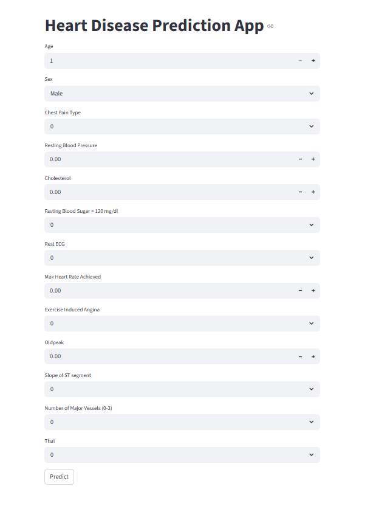

Heart Disease Prediction App
This is a machine learning project where I built a model to predict whether a person has heart disease or not based on their medical data. I also made it into a web app using Streamlit so anyone can use it easily.

# Demo

How it works

User enters medical details like age, cholesterol, blood pressure etc
The data is preprocessed using a scaler
ML model predicts if there is a risk of heart disease or not
Result is shown instantly on the web app

Technologies I used

Python
Scikit-learn
Streamlit
Joblib
NumPy
Pandas

How to run
git clone https://github.com/junaith1704/Heart-Disease-prediction-.git
pip install streamlit scikit-learn joblib numpy pandas
streamlit run app.py

What I learned

Training a classification model using scikit-learn
Saving and loading models with joblib
Building a web app with Streamlit
Data preprocessing and feature scaling

Mohammed Junaith Sulthan.j
B.E CSE (AI & ML) - Sathyabama University
junaith2006@gmail.com
